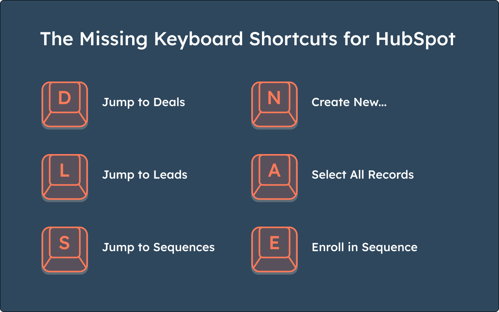

#  HubSpot Keyboard Shortcuts

Adds keyboard shortcuts to HubSpot for chromium-based browsers.

Install from the [Chrome Web Store](https://chromewebstore.google.com/detail/hubspot-keyboard-shortcut/khnbcanbcolodegbjmmbfnmbgnlnjcce).

## Features

- **Navigation Shortcuts**: Navigate between HubSpot pages using single key presses.
- **Action Shortcuts**: Perform common actions on pages with single key presses.

## Keyboard Shortcuts

### 
Navigation Shortcuts

| Shortcut | Action |
| --- | --- |
| `D` | 
Navigate to Deals
 |
| `L` | 
Navigate to Leads
 |
| `S` | 
Navigate to Sequences
 |

### 
Action Shortcuts

| Shortcut | Action |
| --- | --- |
| `N` | 
Select Create New Button
 |
| `A` | 
Select All Records
 |
| `E` | 
Enroll in Sequence
 |
| `Ctrl/Cmd+Enter` | 
Save/Send
 |

## Install from Source

1. Download and unzip `hubspot-keyboard-shortcuts.zip` from the [latest release](https://github.com/archiewood/hubspot-shortcuts/releases)
2. Open Chrome (or any Chromium-based browser) and navigate to chrome://extensions.
3. Enable "Developer mode" in the top right corner.
4. Click "Load unpacked."
5. Select the cloned repository folder.

## Contributing

Contributions are welcome! If you have suggestions for new shortcuts or improvements, please open an issue or submit a PR.
