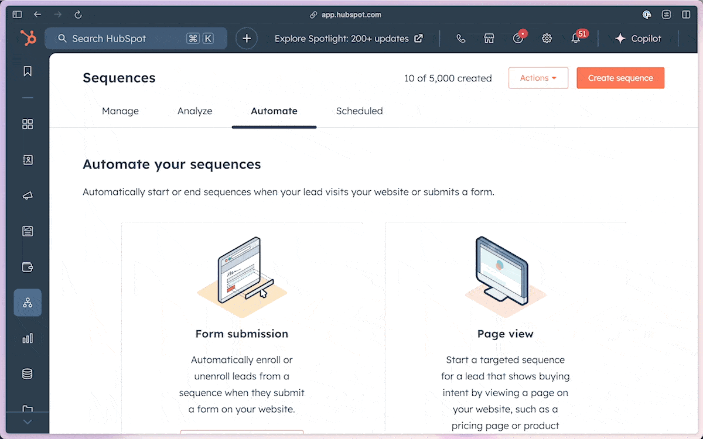

#  HubSpot Keyboard Shortcuts

Adds keyboard shortcuts to HubSpot for chromium-based browsers.

## Features

- **Navigation Shortcuts**: Navigate between HubSpot pages using single key presses.
- **Action Shortcuts**: Perform common actions on pages with single key presses.

## Keyboard Shortcuts

### Navigation Shortcuts

| Shortcut | Action |
|----------|--------|
| `D` | Navigate to the Contacts page |
| `L` | Navigate to the Prospecting Leads page |
| `S` | Navigate to the Sequences page |

### Action Shortcuts

| Shortcut | Action |
|----------|--------|
| `/` | Open the search bar |
| `N` | Press the create button to create a new object |

## Installation

There is currently no Chrome Web Store listing for this extension.

1. Download and uzip `hubspot-keyboard-shortcuts.zip` from the [latest release](https://github.com/archiewood/hubspot-shortcuts/releases)
2. Open Chrome (or any Chromium-based browser) and navigate to chrome://extensions.
3. Enable "Developer mode" in the top right corner.
4. Click "Load unpacked."
5. Select the cloned repository folder.

## Contributing

Contributions are welcome! If you have suggestions for new shortcuts or improvements, please open an issue or submit a PR.
